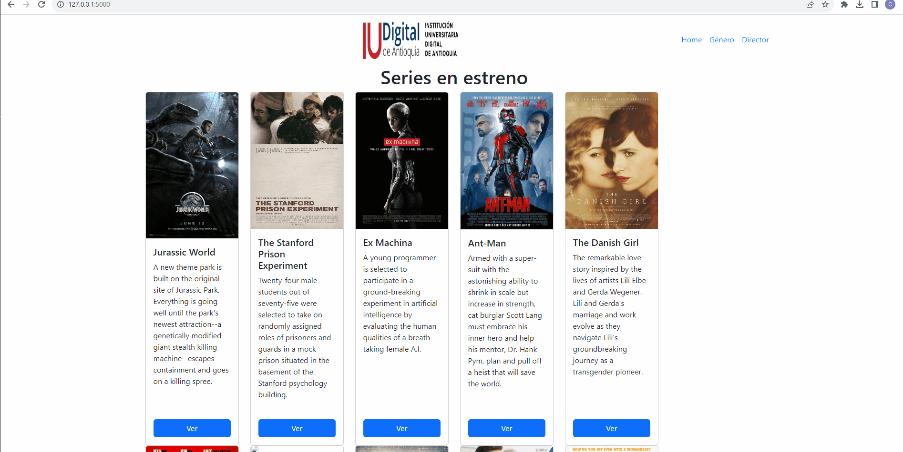

# IUDigital Peliculas Project

Este proyecto utiliza Flask y MongoDB para mostrar una lista de películas.

## Muestra




## Instalación

1. **Clona el Repositorio**  
   Primero, clona el repositorio a tu máquina local usando `git`:

   ```bash
   git clone URL_DEL_REPOSITORIO
   cd NOMBRE_DEL_DIRECTORIO
   ```

   Reemplaza `URL_DEL_REPOSITORIO` con la URL de tu repositorio y `NOMBRE_DEL_DIRECTORIO` con el nombre de tu proyecto/directorio.

2. **Instala las Dependencias**  
   Asegúrate de tener `pip` instalado. Luego, en la raíz del proyecto, ejecuta:

   ```bash
   pip install -r requirements.txt
   ```

   Esto instalará todas las bibliotecas y dependencias necesarias para ejecutar el proyecto.

3. **Configura las Variables de Entorno**  
   Asegúrate de configurar las variables de entorno, especialmente las relacionadas con la conexión a MongoDB.

4. **Configura las variables de entorno**   

   ```bash
   set DB_USERNAME=db_iudigital
   set DB_PASSWORD=(solicitar o usar propia)
   ```

4. **Ejecuta la Aplicación**  
   Una vez que hayas configurado todo, puedes ejecutar la aplicación con:

   ```bash
   python app.py
   ```

   Si todo está configurado correctamente, deberías poder acceder a la aplicación a través de tu navegador en `http://localhost:5000/`.


## Características

- Lista de películas desde una base de datos MongoDB.
- Filtrado de películas por género y director.
- Interfaz amigable basada en Bootstrap.

## Contribución

Si deseas contribuir al proyecto, por favor, haz un fork del repositorio y realiza tus cambios en una rama separada. Luego, puedes hacer un pull request.

## Licencia

Este proyecto es de código abierto y está disponible bajo la licencia MIT.

